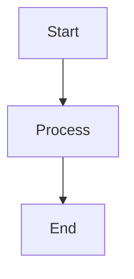

# Docusaurus Documentation Setup Guide

This guide walks through setting up Docusaurus for project documentation.

## Why Docusaurus?

- **Built for Technical Docs**: Designed specifically for software documentation
- **React-Based**: Familiar tech stack
- **Versioning**: Built-in version control for docs
- **Search**: Full-text search out of the box
- **Fast**: Static site generation
- **GitHub Pages**: Easy deployment

## 1. Prerequisites

```bash
# Node.js 18+ required
node --version

# Should output v18.x.x or higher
```

## 2. Initialize Docusaurus

```bash
# From project root
npx create-docusaurus@latest docs-technical classic

# This creates:
# docs-technical/
#   ├── docs/          # Documentation pages
#   ├── blog/          # Blog (optional)
#   ├── src/           # Custom pages
#   ├── static/        # Static assets
#   └── docusaurus.config.js
```

## 3. Configure Docusaurus

Edit `docs-technical/docusaurus.config.js`:

```javascript
// @ts-check
const lightCodeTheme = require('prism-react-renderer/themes/github');
const darkCodeTheme = require('prism-react-renderer/themes/dracula');

/** @type {import('@docusaurus/types').Config} */
const config = {
  title: 'Mulligans Law',
  tagline: 'Mobile application for managing golf scores and leaderboards',
  favicon: 'img/favicon.ico',

  // GitHub Pages config
  url: 'https://barry47products.github.io',
  baseUrl: '/mulligans-law/',
  organizationName: 'barry47products',
  projectName: 'mulligans-law',
  trailingSlash: false,

  onBrokenLinks: 'throw',
  onBrokenMarkdownLinks: 'warn',

  i18n: {
    defaultLocale: 'en',
    locales: ['en'],
  },

  presets: [
    [
      'classic',
      /** @type {import('@docusaurus/preset-classic').Options} */
      ({
        docs: {
          sidebarPath: require.resolve('./sidebars.js'),
          editUrl: 'https://github.com/barry47products/mulligans-law/tree/main/docs-technical/',
        },
        blog: false, // Disable blog for now
        theme: {
          customCss: require.resolve('./src/css/custom.css'),
        },
      }),
    ],
  ],

  themeConfig:
    /** @type {import('@docusaurus/preset-classic').ThemeConfig} */
    ({
      navbar: {
        title: 'Mulligans Law',
        logo: {
          alt: 'Mulligans Law Logo',
          src: 'img/logo.svg',
        },
        items: [
          {
            type: 'docSidebar',
            sidebarId: 'tutorialSidebar',
            position: 'left',
            label: 'Documentation',
          },
          {
            href: 'https://github.com/barry47products/mulligans-law',
            label: 'GitHub',
            position: 'right',
          },
        ],
      },
      footer: {
        style: 'dark',
        links: [
          {
            title: 'Docs',
            items: [
              {
                label: 'Getting Started',
                to: '/docs/getting-started/installation',
              },
              {
                label: 'Architecture',
                to: '/docs/architecture/overview',
              },
            ],
          },
          {
            title: 'More',
            items: [
              {
                label: 'GitHub',
                href: 'https://github.com/barry47products/mulligans-law',
              },
            ],
          },
        ],
        copyright: `Copyright © ${new Date().getFullYear()} Mulligans Law. Built with Docusaurus.`,
      },
      prism: {
        theme: lightCodeTheme,
        darkTheme: darkCodeTheme,
        additionalLanguages: ['dart', 'bash', 'yaml', 'sql'],
      },
      algolia: {
        // Algolia search (add later when docs are substantial)
        // appId: 'YOUR_APP_ID',
        // apiKey: 'YOUR_SEARCH_API_KEY',
        // indexName: 'mulligans-law',
      },
    }),
};

module.exports = config;
```

## 4. Create Documentation Structure

```bash
cd docs-technical

# Create directory structure within docs-technical
# These create: docs-technical/docs/getting-started, etc.
mkdir -p docs/getting-started
mkdir -p docs/architecture
mkdir -p docs/features
mkdir -p docs/api
mkdir -p docs/testing
mkdir -p docs/deployment
```

### Create Initial Pages

**docs-technical/docs/intro.md:**

```markdown
---
sidebar_position: 1
---

# Introduction

Welcome to the Mulligans Law documentation.

This application helps golf societies manage scores, leaderboards, tournaments, and social interactions.

## Key Features

- **Offline-First Score Capture**: Record scores without internet
- **Real-time Leaderboards**: Multiple calculation types
- **Tournament Management**: Flexible season and tournament structures
- **Knockout Competitions**: Bracket-based matchplay
- **Social Features**: Chat, profiles, and photo sharing

## Getting Started

New to the project? Start here:

1. [Installation](getting-started/installation.md)
2. [Local Development Setup](getting-started/local-development.md)
3. [Your First Contribution](getting-started/first-contribution.md)

## Architecture

Learn about the technical architecture:

- [Overview](architecture/overview.md)
- [Clean Architecture](architecture/clean-architecture.md)
- [Offline-First Design](architecture/offline-first.md)
- [Database Design](architecture/database-design.md)

## Need Help?

- Check the [Troubleshooting Guide](getting-started/troubleshooting.md)
- Review [Common Issues](getting-started/common-issues.md)
- Open an issue on [GitHub](https://github.com/barry47products/mulligans-law/issues)
```

**docs-technical/docs/getting-started/installation.md:**

```markdown
---
sidebar_position: 1
---

# Installation

Get Mulligans Law running on your local machine.

## Prerequisites

- Flutter SDK (latest stable)
- Dart SDK (included with Flutter)
- Docker Desktop (for Supabase)
- Xcode (macOS, for iOS)
- Git

## Quick Start

\`\`\`bash

# Clone repository

git clone https://github.com/barry47products/mulligans-law.git
cd mulligans-law

# Install Flutter dependencies

flutter pub get

# Start Supabase

supabase start

# Run app

flutter run -d ios
\`\`\`

See [Local Development](local-development.md) for detailed setup instructions.
```

## 5. Configure Sidebar

Edit `docs-technical/sidebars.js`:

```javascript
/** @type {import('@docusaurus/plugin-content-docs').SidebarsConfig} */
const sidebars = {
  tutorialSidebar: [
    "intro",
    {
      type: "category",
      label: "Getting Started",
      items: [
        "getting-started/installation",
        "getting-started/local-development",
        "getting-started/first-contribution",
        "getting-started/troubleshooting",
      ],
    },
    {
      type: "category",
      label: "Architecture",
      items: [
        "architecture/overview",
        "architecture/clean-architecture",
        "architecture/offline-first",
        "architecture/database-design",
      ],
    },
    {
      type: "category",
      label: "Features",
      items: [
        "features/authentication",
        "features/score-capture",
        "features/leaderboards",
        "features/tournaments",
      ],
    },
    {
      type: "category",
      label: "API Reference",
      items: ["api/repositories", "api/use-cases", "api/blocs"],
    },
    {
      type: "category",
      label: "Testing",
      items: [
        "testing/tdd-approach",
        "testing/unit-testing",
        "testing/integration-testing",
      ],
    },
    {
      type: "category",
      label: "Deployment",
      items: ["deployment/ci-cd", "deployment/releasing"],
    },
  ],
};

module.exports = sidebars;
```

## 6. Test Locally

```bash
cd docs-technical

# Install dependencies
npm install

# Start development server
npm start

# Opens browser to http://localhost:3000
```

## 7. Set Up GitHub Pages Deployment

Create `.github/workflows/deploy-docs.yml`:

```yaml
name: Deploy Documentation

on:
  push:
    branches: [main]
    paths:
      - "docs-technical/**"
      - ".github/workflows/deploy-docs.yml"

permissions:
  contents: write

jobs:
  deploy:
    name: Deploy to GitHub Pages
    runs-on: ubuntu-latest

    steps:
      - name: Checkout
        uses: actions/checkout@v4

      - name: Setup Node.js
        uses: actions/setup-node@v4
        with:
          node-version: 18
          cache: npm
          cache-dependency-path: docs-technical/package-lock.json

      - name: Install dependencies
        run: |
          cd docs-technical
          npm ci

      - name: Build website
        run: |
          cd docs-technical
          npm run build

      - name: Deploy to GitHub Pages
        uses: peaceiris/actions-gh-pages@v3
        with:
          github_token: ${{ secrets.GITHUB_TOKEN }}
          publish_dir: ./docs-technical/build
          user_name: github-actions[bot]
          user_email: github-actions[bot]@users.noreply.github.com
```

## 8. Enable GitHub Pages

1. Go to repository **Settings** → **Pages**
2. Source: Deploy from a branch
3. Branch: `gh-pages` / `root`
4. Save

After first deployment, site will be available at:
`https://barry47products.github.io/mulligans-law/`

## 9. Documentation Workflow

### Adding New Documentation

```bash
# Create new markdown file
touch docs-technical/docs/features/new-feature.md

# Add frontmatter and content
---
sidebar_position: 5
---

# New Feature

Content here...

# Update sidebar if needed (docs-technical/sidebars.js)

# Preview locally
cd docs-technical && npm start

# Commit
git add docs-technical/
git commit -m "docs: add new feature documentation"
git push
```

### Documentation Standards

**Frontmatter:**

```markdown
---
sidebar_position: 1
sidebar_label: Custom Label
title: Page Title
description: Meta description
---
```

**Code Blocks:**

````markdown
```dart
// Dart code with syntax highlighting
class Example {}
```

```bash
# Bash commands
flutter run
```
````

**Admonitions:**

```markdown
:::tip
Helpful tip
:::

:::warning
Warning message
:::

:::danger
Danger alert
:::

:::info
Information
:::
```

**Images:**

```markdown

```

## 10. Maintenance

### Regular Updates

- Update docs when features change
- Keep examples current with code
- Review outdated content quarterly
- Update screenshots when UI changes

### Version Management

When releasing v1.0.0, add versioning:

```bash
cd docs-technical
npm run docusaurus docs:version 1.0.0

# Creates:
# - versioned_docs/version-1.0.0/
# - versions.json
```

## 11. Advanced Features

### Search (Algolia)

Once docs are substantial:

1. Apply for [Algolia DocSearch](https://docsearch.algolia.com/)
2. Add credentials to `docusaurus.config.js`
3. Free for open source projects

### Custom Pages

Create custom React pages in `docs-technical/src/pages/`:

```jsx
// src/pages/roadmap.js
import React from "react";
import Layout from "@theme/Layout";

export default function Roadmap() {
  return (
    <Layout title="Roadmap" description="Product Roadmap">
      <div style={{ padding: "2rem" }}>
        <h1>Roadmap</h1>
        {/* Custom content */}
      </div>
    </Layout>
  );
}
```

### Mermaid Diagrams

```bash
npm install --save @docusaurus/theme-mermaid
```

Then use in markdown:

````markdown

````

## 12. Troubleshooting

### Build Fails

```bash
cd docs-technical
npm run clear
npm run build
```

### Broken Links

Check output when building - Docusaurus throws errors on broken links.

### Port 3000 in Use

```bash
npm start -- --port 3001
```

## Next Steps

1. ✅ Set up Docusaurus structure
2. ✅ Create initial documentation pages
3. ✅ Configure GitHub Pages deployment
4. 🔜 Add documentation as you build features
5. 🔜 Keep docs in sync with code
6. 🔜 Add search when docs grow

## Resources

- [Docusaurus Documentation](https://docusaurus.io/)
- [Markdown Guide](https://docusaurus.io/docs/markdown-features)
- [GitHub Pages](https://pages.github.com/)
